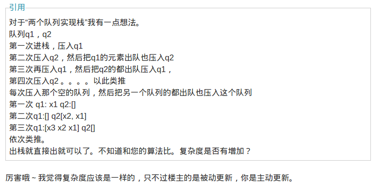

###stack & queue

两个栈实现一个队列这种题其实不只是为了面试时炫技，其思想可以应用到**服务端的读写分离，在一定条件下能提高并发程序的执行效率。**

其实现原理很简单就不说了，不过类似的还有用两个队列实现一个栈的，相关博文：
[两个栈实现队列 两个队列实现栈](http://www.cnblogs.com/kaituorensheng/archive/2013/03/02/2939690.html#3085316)

博文中有详细介绍到，无论是两栈实现一个队列，还是两队列实现一个栈，其逆转的思想和细节要好好体会。其中文章里介绍到的两个队列实现栈有两种方法，一种是博主的思路：
> q1是专职进出栈的，q2只是个中转站。元素集中存放在一个栈中，但不是指定(q1 或 q2)。

> 定义两个指针：pushtmp:指向专门进栈的队列q1； tmp：指向临时作为中转站的另一个栈q2

> 入栈：直接入pushtmp所指队列即可

> 出栈：把pushtmp的除最后一个元素外全部转移到队列tmp中,然后把刚才剩下q1中的那个元素出队列

另一种方法：

两种方法在复杂度上有微小的差别，前者在出栈较耗时间（O(n)），后者在入栈较耗时间（O(n)），其余都是O(1)，所以我在想能否利用这个差别应用到实际业务中去：**当读操作较频繁而写操作很少（也就是出栈多入栈少）时，我们用第二种方法来实现；反之当写操作频繁而读操作很少（入栈多出栈少）时，用第一种方法来实现，这样子总复杂度就可以近乎O(1)，对两种方法也就扬长避短地使用了**，同理，两个栈实现队列也可以用类似的思想迁移至实际中。